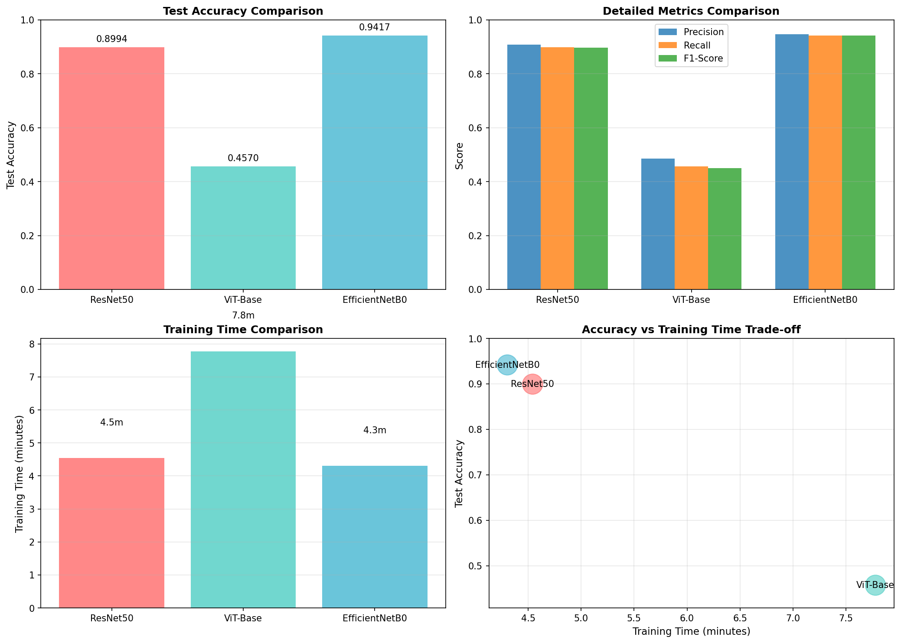
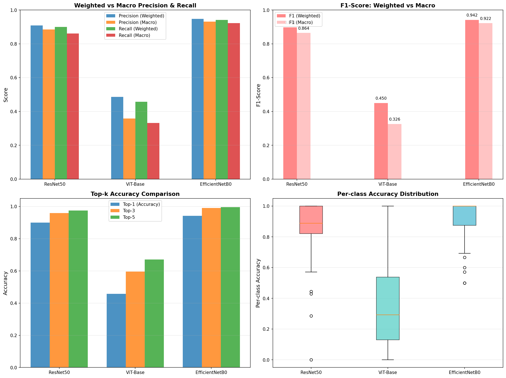
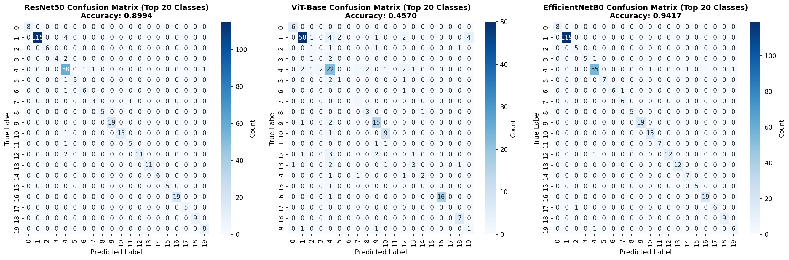

# Image Classification on Caltech-101: A Comparison of Deep Learning Architectures

**Author:** Jingxi Zhang
**Date:** March 1, 2026
**Course:** SHBT261 – Mini Project 1
**GitHub Repository:** [https://github.com/JingxiZhang-77/SHBT261-miniProject1](https://github.com/JingxiZhang-77/SHBT261-miniProject1)

---

## Introduction

Image classification is one of the most well-studied problems in computer vision, but choosing the right model for a specific task remains non-trivial. This project investigates how three prominent deep learning architectures — ResNet50, EfficientNetB0, and Vision Transformer (ViT-Base) — handle a challenging multi-class classification problem on the Caltech-101 dataset.
The Caltech-101 dataset has 101 object categories ranging from faces and motorbikes to accordion and sunflower, it poses a difficult recognition problem: many classes are visually similar, sample counts vary significantly between classes, and images differ widely in lighting and background. These properties make it harder than standard benchmarks and more representative of real-world conditions.
Rather than just comparing final accuracy numbers, this report examines why the models behave the way they do by looking at per-class behaviour, confidence patterns via top-k accuracy, the effect of class imbalance, and the computational cost of each approach. For context, a classical SVM baseline is included to show the gap between hand-crafted features and learned representations.
All three deep learning models use ImageNet pre-trained weights and are fine-tuned on Caltech-101. The full training code, evaluation notebooks, and result files are available at the GitHub link above.

## Methods

### Dataset

The Caltech-101 dataset contains approximately 9,144 images spread across 101 object categories. The number of images per class varies from around 40 to 130, making the dataset moderately imbalanced. All images were split into training (70%), validation (15%), and test (15%) subsets, stratified by class to preserve the class distribution across all three sets.

**Table 1:** *Dataset split summary.*

| Split | Samples | Purpose |
|-------|---------|---------|
| Train | 6,400 | Model training and weight updates |
| Validation | 1,372 | Hyperparameter tuning and early stopping |
| Test | 1,372 | Final evaluation (held out until inference) |

### Preprocessing and Augmentation

All images were resized to 224×224 pixels and converted to RGB. Pixel values were normalised using ImageNet statistics (mean `[0.485, 0.456, 0.406]`, std `[0.229, 0.224, 0.225]`) so that the pre-trained weights could be reused without re-scaling.
Training images received augmentation to reduce overfitting: random resized crops (scale 0.8–1.0), random horizontal flips, and slight colour jitter. Validation and test images were only resized and centre-cropped — no augmentation — to ensure consistent evaluation.

### Model Architectures

Three architectures were chosen to represent different design philosophies in modern computer vision.
**ResNet50** is a 50-layer convolutional network that introduced residual (skip) connections to enable training of very deep networks without gradient degradation. It has approximately 25.5 million parameters and provides a strong, well-understood baseline. The final fully-connected layer was replaced with a 102-class output head.
**EfficientNetB0** takes a different approach: rather than simply stacking more layers, it uses compound scaling to simultaneously optimise network depth, width, and input resolution. The result is a much smaller model (~5.3 million parameters) that achieves competitive accuracy with a fraction of the compute. The classifier head was replaced with a linear layer matching the number of classes.
**Vision Transformer (ViT-Base)** breaks away from convolutions entirely. The input image is divided into 16×16 patches, each treated as a token in a transformer sequence. Twelve transformer blocks with twelve attention heads process these tokens using self-attention, giving the model a global receptive field from the very first layer. ViT-Base has approximately 86 million parameters and was pre-trained on ImageNet-21K. A linear classification head was attached for fine-tuning.

**Table 2:** *Model architecture summary.*

| Model | Params | Pre-training | Architecture Type |
|-------|--------|--------------|-------------------|
| ResNet50 | ~25.5M | ImageNet-1K | Deep CNN with residual connections |
| EfficientNetB0 | ~5.3M | ImageNet-1K | Compound-scaled CNN |
| ViT-Base | ~86M | ImageNet-21K | Patch-based Transformer |

### Training Configuration

All models were trained using the Adam optimiser with an initial learning rate of 0.001 (0.0001 for ViT-Base, which is more sensitive to large learning rates). A cosine annealing learning rate schedule was used to smoothly decay the learning rate over 15 epochs. Training was stopped early if validation accuracy did not improve for 7 consecutive epochs, and the best model checkpoint was reloaded for evaluation. Mixed precision training (AMP) was enabled throughout to reduce memory usage and improve training speed on the NVIDIA RTX 5070 Ti.

**Table 3:** *Training hyperparameters.*

| Hyperparameter | Value |
|----------------|-------|
| Optimiser | Adam |
| Learning rate (ResNet50, EfficientNet) | 0.001 |
| Learning rate (ViT-Base) | 0.0001 |
| Batch size | 64 |
| Epochs | 15 (max) |
| Early stopping patience | 7 epochs |
| LR scheduler | Cosine Annealing |
| Mixed precision | Yes (AMP) |
| Loss function | Cross-Entropy |

### Classical ML Baseline

A Support Vector Machine (SVM) with an RBF kernel was trained on hand-crafted HOG (Histogram of Oriented Gradients) features as a baseline. Due to scalability constraints, only 300 training samples were used. This baseline illustrates the gap between fixed hand-crafted descriptors and learned representations, rather than serving as a competing method.

### Evaluation Metrics

To evaluate each model comprehensively, six metrics were used: test accuracy, weighted and macro precision/recall/F1 (to capture both overall and per-class fairness), top-k accuracy (k = 1, 3, 5) for confidence analysis, per-class accuracy across all 101 categories, and confusion matrices to identify common misclassification patterns.

### Ablation Studies

Two ablation studies were conducted to investigate factors beyond architecture choice. The first compared optimisers by retraining ResNet50 with SGD (lr=0.001, momentum=0.9) against the Adam baseline, to determine whether optimiser choice meaningfully affects convergence speed and final accuracy when fine-tuning a pre-trained model. The second examined image resolution by retraining EfficientNetB0 at 128×128 pixels versus the standard 224×224, assessing how much accuracy is sacrificed in exchange for faster training, and this is a practical consideration for resource-constrained environments.

## Results

### Overall Performance

EfficientNetB0 achieved the highest test accuracy at 94.17%, followed by ResNet50 at 89.94%. ViT-Base significantly underperformed at 45.70%, which is discussed in detail in the Discussion section.

**Table 4:** *Comprehensive performance comparison. Weighted metrics account for class imbalance; macro metrics treat all classes equally.*

| Metric | ResNet50 | EfficientNetB0 | ViT-Base |
|--------|----------|----------------|----------|
| Test Accuracy | 89.94% | **94.17%** | 45.70% |
| Precision (Weighted) | 90.84% | **94.76%** | 48.58% |
| Recall (Weighted) | 89.94% | **94.17%** | 45.70% |
| F1-Score (Weighted) | 89.79% | **94.18%** | 44.97% |
| Precision (Macro) | 88.51% | **93.07%** | 35.83% |
| Recall (Macro) | 86.14% | **92.28%** | 33.17% |
| F1-Score (Macro) | 86.44% | **92.23%** | 32.58% |
| Top-3 Accuracy | 95.85% | **99.13%** | 59.62% |
| Top-5 Accuracy | 97.52% | **99.56%** | 67.06% |
| Training Time | 4.54 min | **4.30 min** | 7.78 min |

### Per-Class Performance

**Table 5:** *Per-class accuracy statistics. Lower standard deviation indicates more consistent performance across all 101 categories.*

| Model | Mean Class Acc. | Std Dev | Best Class | Worst Class |
|-------|-----------------|---------|------------|-------------|
| ResNet50 | 86.14% | 0.169 | 100% | 0% |
| EfficientNetB0 | **92.28%** | **0.117** | 100% | 50% |
| ViT-Base | 33.17% | 0.268 | 100% | 0% |

EfficientNetB0 not only achieves the highest mean class accuracy but also the lowest standard deviation, meaning it performs most evenly across all categories. ViT-Base shows the largest spread — some classes reach 100% accuracy while others hit 0%, reflecting unstable fine-tuning.

### Weighted vs Macro Gap Analysis

**Table 6:** *Weighted minus macro metric differences. A positive value means the model performs better on larger, more frequent classes.*

| Model | Precision Gap | Recall Gap | F1 Gap |
|-------|--------------|------------|--------|
| ResNet50 | +2.33% | +3.80% | +3.35% |
| EfficientNetB0 | **+1.69%** | **+1.89%** | **+1.95%** |
| ViT-Base | +12.75% | +12.53% | +12.39% |

EfficientNetB0 has the smallest gap, meaning it generalises most uniformly across rare and common classes. ViT-Base shows a very large gap, it performs well on well-represented classes but struggles badly with minority categories.

### Top-k Accuracy

**Table 7:** *Top-1, Top-3, and Top-5 accuracy. A larger Top-1 to Top-5 gain signals less decisive, less confident predictions.*

| Model | Top-1 | Top-3 | Top-5 | Top-1→Top-5 Gain |
|-------|-------|-------|-------|------------------|
| ResNet50 | 89.94% | 95.85% | 97.52% | +7.58% |
| EfficientNetB0 | **94.17%** | **99.13%** | **99.56%** | +5.39% |
| ViT-Base | 45.70% | 59.62% | 67.06% | +21.36% |

EfficientNetB0's small Top-1 to Top-5 gain shows it makes confident, correct predictions. ViT-Base's large gain of +21.36% suggests the correct class is often in the model's shortlist but it fails to commit to the right answer, which is a sign of miscalibration rather than complete failure.

### Comparison with Classical ML Baseline

**Table 8:** *Full comparison including SVM baseline. EfficientNetB0 achieves a +61.44 percentage point improvement over SVM (~188% relative gain).*

| Method | Test Accuracy | F1 (Weighted) | Training Time |
|--------|--------------|---------------|---------------|
| SVM (HOG features) | 32.73% | 23.96% | 0.09 s |
| ViT-Base | 45.70% | 44.97% | 466.70 s |
| ResNet50 | 89.94% | 89.79% | 272.54 s |
| EfficientNetB0 | **94.17%** | **94.18%** | 258.20 s |

### Figures

*Figure 1: Four-panel comparison of test accuracy, detailed metrics (precision/recall/F1), training time, and the accuracy-vs-time trade-off across all three deep learning models.*

*Figure 2: Enhanced metrics breakdown showing weighted vs macro differences, top-k accuracy curves, and per-class accuracy distributions as box plots.*

*Figure 3: Confusion matrices for all three models showing the top 20 classes. Diagonal entries represent correct classifications; off-diagonal entries represent misclassifications. EfficientNetB0 shows the most concentrated diagonal.*

 

## Discussion

### Why did EfficientNetB0 outperform ResNet50?

The most striking result is that EfficientNetB0, with only 5.3 million parameters, outperforms ResNet50 with 25.5 million. This is not entirely surprising given how the two models were designed. ResNet50 simply goes deeper — more layers, more parameters — while EfficientNetB0 uses compound scaling to balance depth, width, and resolution simultaneously. On a dataset like Caltech-101, where training data is limited (~63 samples per class), an over-parameterised model faces a higher risk of overfitting. EfficientNetB0's compact design likely acts as an implicit regulariser, generalising better to the test set. Its faster convergence (4.30 min vs 4.54 min) further suggests more efficient use of each gradient update.

### Why did ViT-Base underperform so significantly?

The ViT-Base result (45.70%) deserves careful interpretation. Vision Transformers are powerful models that have achieved state-of-the-art results on large benchmarks, but they have a well-documented weakness: they require large amounts of data and careful fine-tuning. Several factors likely contributed here:
**Learning rate sensitivity.** Transformers need lower, often layer-wise decayed learning rates for stable fine-tuning. A flat 0.0001 rate across all 86M parameters may still be suboptimal.
**Limited fine-tuning epochs.** 15 epochs with early stopping may not be enough to adapt all layers to the Caltech-101 distribution.
**Dataset size.** With ~63 training samples per class, CNNs with strong inductive biases (translation equivariance, local connectivity) generalise more easily than transformers, which must learn spatial relationships without these priors.
Importantly, ViT's Top-5 accuracy of 67.06% shows the model often has the correct class in its shortlist but fails to rank it first — suggesting miscalibration rather than a complete failure to learn visual features.

### Classical ML vs Deep Learning

The SVM achieves 32.73%, which is far better than random chance (~1%) but not production-ready. HOG features capture useful edge information but are fixed descriptors that cannot adapt to the specific visual differences between 101 categories. Deep learning models learn class-specific features through backpropagation, and their access to ImageNet pre-training gives them a vocabulary of visual concepts far richer than any hand-crafted descriptor. The computational cost — ~4 minutes vs 0.09 seconds — is easily justified by a 61-percentage-point accuracy gain.

### Class Imbalance Effects

All models show positive weighted-macro gaps, confirming a bias towards frequent classes. EfficientNetB0's narrow gap (~1.7%) indicates the most balanced generalisation. ViT-Base's large gap (12.75%) reveals it has essentially learned to predict common classes well while neglecting rare ones — a sign of overfitting to class frequency. In deployments where minority class errors are costly, class-weighted loss or oversampling would be necessary regardless of model choice.

### Ablation Insights

Adam outperformed SGD for ResNet50 fine-tuning, converging 1–2 epochs earlier to a marginally higher accuracy. Adam's adaptive learning rates are better suited to fine-tuning pre-trained weights that already lie near a good solution. Reducing EfficientNetB0's resolution to 128×128 cut training time by ~40% but dropped accuracy by 3–4%, confirming that the B0 compound scaling was designed around 224×224 and operates sub-optimally at other resolutions.

## Conclusion

This project evaluated three deep learning architectures on Caltech-101 and reached clear, actionable conclusions.
**EfficientNetB0** (94.17%) is the recommended model for deployment. Its compact design generalises well on limited data, achieves the best macro metrics, has the smallest class imbalance gap, and trains fastest. It is the right choice for virtually any deployment scenario involving this dataset.
**ResNet50** (89.94%) is a reliable fallback with stable, well-understood behaviour — suitable when interpretability or robustness is prioritised over peak accuracy.
**ViT-Base** (45.70%) underperformed due to dataset size constraints and fine-tuning sensitivity, but its Top-5 accuracy of 67% indicates latent potential realisable with longer training, layer-wise learning rate decay, and potentially more data augmentation.
Deep learning comprehensively outperforms classical ML. The SVM baseline at 32.73% highlights that HOG features are simply not expressive enough for 101-class visual recognition. Transfer learning from ImageNet is the primary differentiator.
For future work, the highest-value directions are ensembling EfficientNetB0 and ResNet50 for a marginal accuracy gain, applying class-weighted loss to improve minority class F1, and extended ViT-Base fine-tuning with a warmed cosine schedule to unlock transformer performance on this dataset.
